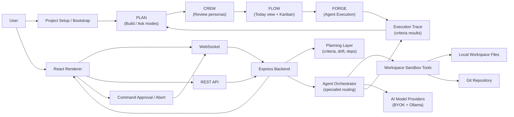

# System Architecture

## 1. Architecture Summary

Kryleos Forge is the only AI coding tool that operates at the project level — managing the full **Build Loop**: PLAN → CREW → FLOW → FORGE → trace → verify. The architecture is built around that loop: the planning layer drives board state, board state drives agent execution, and agent execution writes evidence back to the plan via structured acceptance criteria.

Runtime components:

- **Renderer:** React SPA served by Vite.
- **Desktop shell:** Electron main/preload process.
- **Local backend:** Express server with REST APIs and WebSocket streaming.
- **Planning layer:** Plan import, 3-way merge, drift detection, execution tracing, and multi-repo task routing.
- **Agent layer:** TypeScript orchestrator that delegates work between specialist roles and tools, and traces results back to originating plan items.
- **Workspace layer:** sandboxed local file/Git command utilities.

## 2. Runtime Components

### Planning Layer

Responsibilities:

- Parse and import implementation plans from Markdown, PRD documents, structured checklist formats, and external sources (GitHub Issues — Phase 3, Linear — Phase 5–6).
- Perform 3-way merge when an imported plan conflicts with an existing workspace plan (`diff3.ts`).
- Reconcile dependency conflicts across multiple `package.json` files when plans span repos.
- At plan item creation, call AI to generate Phase 1 abstract structural acceptance criteria (no file paths assumed: `symbol_exists: "authenticateUser"`, `test_passes: "auth suite"`, `llm_check: "login flow handles invalid credentials"`) and present for user review before saving.
- On workspace selection, run a background scan and queue Phase 2 criteria enrichment (resolve abstract criteria to real file paths). Surface a non-blocking banner when ready. Phase 2 also re-runs after first agent run. Phase 1 criteria remain valid for drift detection indefinitely if no workspace is selected.
- Bootstrap onboarding for existing codebases: (1) workspace scan → project fingerprint; (2) guided PLAN session — AI generates Phase 1 structural criteria per described item AND evaluates them against the workspace scan immediately (`llm_check` skipped during bootstrap); items where all structural criteria pass → "Likely Complete (bootstrap)" for user confirmation; bootstrap scan stored as the execution trace; (3) free first "What's Left" run regardless of tier.
- Populate the FLOW Kanban board from imported plan items automatically.
- Route individual plan items to the agent orchestrator on user request, passing `planItemId` and workspace assignment.
- Route to the specialist agent matching the item's category tag (frontend/backend/testing/security/docs/infra).
- Enforce plan item dependencies: prevent `Send to FORGE Agent` on items with unresolved `blockedBy[]` entries.
- Assign plan items to specific workspace directories for multi-repo execution.
- Detect plan drift by evaluating each item's acceptance criteria against codebase signals. Classify as Complete, In Progress, Not Started, Diverged, or Needs Review. Structural criteria (`file_exists`, `symbol_exists`, `git_grep`, `test_passes`) evaluated first with real code checks — zero LLM cost. Diverged LLM call fires only if a structural criterion fails. Results cached per item with the git commit hash of relevant files; unchanged items skipped on subsequent runs. Max 10 LLM-evaluated items per drift run with a "X items deferred" notice.
- Run drift detection automatically after agent runs and on demand. Expose `GET /api/plan/drift`.
- Store execution traces under `.kryleos/traces/` linking agent runs to their originating plan items with per-criterion results. Traces produced by a dedicated post-run structured-output extraction call (not stream parsing): structural criteria evaluated by real code checks; `llm_check` evaluated by LLM; result serialized as `ExecutionTrace` JSON via function/tool calling where supported.
- Auto-close plan items when all acceptance criteria pass, with mandatory user confirmation before persistence.
- Provide "What's Left" summary action: tier-gated item limits (Free=5, Solo=25, Solo Plus=50, Founder=unlimited). Free-tier 5 items are AI-prioritized via a single LLM call scoring blocking potential, delivery risk, and execution readiness — returns `{id, reason}[]` ordered by score.
- Export PLAN as structured .md for PLAN→CREW Free handoff. Provide direct sync for paid tiers.

### VS Code Extension (deferred — Phase 3+)

Responsibilities (when built):

- Connect to the running Forge desktop backend over `localhost:3001` via REST and WebSocket.
- Detect the VS Code open folder and POST it to `/api/workspace` to sync the workspace path.
- Provide a right-click context menu item (`Ask Forge Agent`) on files and selections.
- Stream agent responses into a VS Code output panel.
- Provide a VS Code sidebar webview polling `/api/review/current` with Accept and Reject controls.
- Show a connection status indicator when the Forge backend is not running.
- Not perform inline autocomplete or copilot-style suggestions in V1.
- Depend entirely on existing backend routes — no new backend routes required.

Packaging (when built):

- Lives in a `kryleos-forge-vscode/` package in the monorepo.
- Published as a `.vsix` to the VS Code Marketplace.
- Clearly labeled as a Forge companion, not a standalone coding assistant.

### Electron Main Process

Responsibilities:

- Create the desktop app window.
- Load the local Vite/frontend URL or production build.
- Provide native desktop capabilities such as folder selection through preload APIs.

### React Renderer

Responsibilities:

- Display chat console, project board, file browser, code graph, config modal, onboarding, and the planned coding Preview Deck.
- Store UI preferences and local config in browser localStorage.
- Send commands/configuration to the backend.
- Receive streamed agent/chat updates over WebSocket.
- Coordinate Preview Deck state for files, live preview URL, terminal evidence, side chat, artifacts, and review summary.

### Express Backend

Responsibilities:

- Serve REST routes for sessions, files, workspace, Git, credentials, Google integration, artifacts, and sync.
- Own the active workspace sandbox.
- Initialize model clients.
- Host the WebSocket server.
- Route incoming user queries to either chat mode or the agent orchestrator.
- Evaluate account/tier state for sync, collaboration indicators, and feature-gated execution banners.
- Route command approval and abort messages from WebSocket clients to the active orchestrator.
- Reject stale command approvals when their `commandId` does not match the active pending command.
- Future Preview Deck support should expose local preview server discovery, artifact listing/content, and server start/stop controls without bypassing command approval.

### Agent Orchestrator

Responsibilities:

- Maintain session logs and checklists.
- Load custom agents and skills.
- Build role-specific system prompts.
- Delegate work to specialist roles.
- Execute approved workspace tools.
- Stream progress and results to the UI.
- Load `.cursorrules` and `.cursor/rules` into system instructions when present.
- Pause on pending command approval before executing `runCommand`.
- Release pending approval locks and stop active processes during graceful abort.
- Accept a plan item context payload when invoked from the PLAN space, so execution output can be traced back to the originating item.
- Emit a structured execution result (files changed, commands run, outcomes) after each run for the planning layer to consume.
- Activate the correct workspace directory when a plan item carries a workspace assignment (multi-repo routing).

### Workspace Sandbox

Responsibilities:

- Resolve paths relative to the selected workspace.
- Prevent file access outside the workspace.
- Read, write, modify, list, and search files.
- Execute commands in the workspace.
- Provide Git helper operations.
- Surface local-host execution warnings for Free/Basic tiers and remote-container simulation banners for Pro/Enterprise tiers.
- Track active command child processes so they can be terminated on abort.
- Remove child processes from tracking when they close or error.

### Subscription and Sync Layer

Responsibilities:

- Store user tier and role metadata.
- Block cross-device sync for Free users.
- Allow Basic and higher tiers to push/pull WebSocket-powered state sync.
- Represent Enterprise collaboration and RBAC simulator state.
- Support mocked subscription upgrades through auth/subscribe flows.

## 3. High-Level Flow

## 4. Major UI Spaces — The Build Loop

The four spaces form the **Build Loop**: PLAN → CREW → FLOW → FORGE (→ trace → verify → PLAN). Chat is not a separate tab.

- **Plan:** Primary AI interface for the app. Two modes: **Build mode** (default — inputs build the project spec, sessions persist and accumulate; plan item creation triggers acceptance criteria generation) and **Ask mode** (ephemeral query that does not affect the spec — replaces the former Chat tab). Users can ideate on mobile/web; spec builds across sessions. PLAN→CREW handoff: Free = structured .md export; paid = direct Desktop sync.
- **Crew:** specialist agent review. Personas (Technical Reviewer, Scope Guard, Risk Identifier) review the plan and produce a **structured refined plan document**. "Push to FLOW" action diffs CREW's output against existing FLOW tasks — user confirms the diff before FLOW is updated. Community agent starter packs (7 bundled: React Expert, Security Auditor, Test Writer, Documentation Writer, Performance Reviewer, Python Backend Specialist, DevOps Specialist). Skills factory.
- **Flow:** project management and execution prep. **Today view** is the default landing (3–5 unblocked tasks selected by priority score: +10 in-progress with active trace, +5 recently unblocked, +3×dependency fan-out, +1×days-since-creation capped at 7; recalculates deterministically on every open, no AI call). Execute Next, Execute All Today. Full Kanban board accessible from Today. Agent-assisted item actions: Break down, Estimate, Execute. CREW output pushed to FLOW via structured Markdown diff (`[ITEM]` anchor format) with user confirmation. Tasks grouped by repo, color-coded by category, blocked items greyed. Mobile companion home screen shows the same Today view.
- **Forge:** code/file explorer, graph visualizer, Git-backed review, and Preview Deck. Specialist agent routing by item category. Emits execution traces with acceptance criteria results back to the planning layer.

Tab labels in the UI must be clean words without bracket/function-key annotation in the primary visual. Keyboard shortcuts remain available but appear as tooltips rather than the tab label itself.

### Planned Preview Deck

The Preview Deck is a right-side coding workspace surface that should include:

- Files.
- Live Preview.
- Terminal evidence.
- Side Chat.
- Artifacts.
- Review summary.

MVP architecture should keep this as a renderer-owned fixed deck. Backend support should be added only for server discovery/start/stop and artifact retrieval. Full browser automation, remote tunnels, and multiple interactive terminal PTYs are later architecture concerns.

## 5. Deployment Model

The app is currently built as a local desktop app. The frontend is compiled with Vite and wrapped in Electron. The backend runs locally as part of the desktop development/runtime environment.

Hosted Cloud IDE behavior is currently represented as a Pro/Enterprise simulation through account linking and WebSocket sync around Electron-managed files, not as a production hosted IDE.

## 6. Architectural Constraints

- The app assumes local filesystem access.
- The backend assumes one active workspace sandbox per backend process; multi-repo plans activate sandboxes per plan item execution.
- Long-running or unsafe shell commands should be treated carefully.
- API keys and sync data must be handled with more robust secure storage before production release.
- Team collaboration, RBAC, billing, hosted IDE, and remote container execution should be treated as tier-aware simulations unless backed by production services.
- Command approvals should be treated as required safety gates for AI-proposed CLI execution.
- Preview Deck server start/stop and terminal behavior must reuse the same command approval and abort safety model.
- Embedded previews must not expose provider keys, workspace secrets, or privileged backend APIs to untrusted pages.
- Graceful abort must be idempotent and safe to call even when no command is active.
- The reviewed implementation uses WebSocket user approval plus command ID matching. Browser-side cryptographic approval signatures are not currently wired into the UI.
- The VS Code extension must not introduce new backend security surface area. It communicates only through existing authenticated REST and WebSocket routes.
- Zero Egress Mode must be enforced in the backend model routing layer, not only in the frontend toggle state. When enabled, non-Ollama provider calls must be rejected server-side.
- Community Agent Starter Packs ship as static JSON/Markdown files bundled with the app binary and installed into the workspace `.kryleos/agents/` directory on user request. No external network call is required for installation.
- Execution traces must be stored locally under `.kryleos/traces/` and must never be sent to external services unless the user explicitly exports them.
- Plan drift detection must operate entirely against local codebase signals (file system, Git log, source symbols). No external API calls are permitted for drift classification.
- Auto-completion of plan items based on execution evidence must be non-destructive and require user acknowledgment before persisting status changes.
- Multi-repo plan routing must activate the assigned workspace sandbox without resetting session state in other workspaces.
- **Offline (Desktop):** Ollama local models enable offline PLAN ideation and FORGE execution on Desktop. This is a valid and supported use case — the backend, file tools, Git tools, and local models all function without internet.
- **Offline (Mobile):** mobile offline coding is out of scope. Mobile can queue PLAN notes (text capture) while offline. LLM execution and FORGE agent runs require connectivity to a Desktop backend or hosted model provider.
- Plan item dependencies (`blockedBy[]`) must be enforced in the planning layer, not only in the UI. `Send to FORGE Agent` must be blocked server-side for items with unresolved dependencies.
- Acceptance criteria must be stored per plan item and must be the exclusive evaluation mechanism for drift detection and execution trace classification — no raw plan text comparison in the classification logic.
- "What's Left" summary must be gated to Founder tier server-side before generating the full drift report.
- PLAN→CREW direct sync must be blocked for Free tier users server-side. Free tier users receive the .md export flow only.
