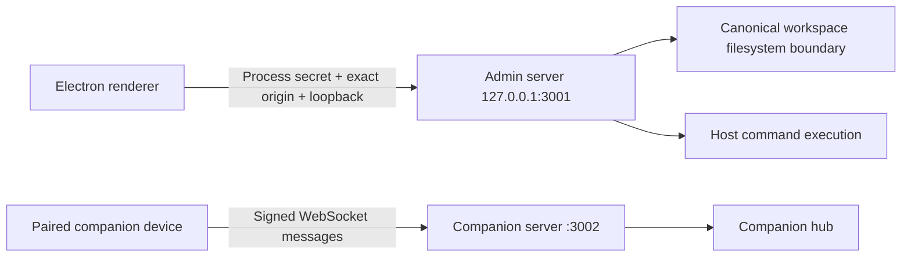

# Kryleos Forge Security Threat Model

Updated June 16, 2026.

## Trust boundaries

## Protected assets

- Provider and billing credentials.
- Local source code and planning data.
- Host command-execution authority.
- Companion device tokens and signing identity.
- Subscription and account state.

## Principal threats and controls

### LAN access to administrative APIs

The admin listener is hard-coded to loopback. Companion LAN access is isolated on a separate listener that serves no administrative HTTP routes and accepts only `/api/companion/ws` upgrades.

### Cross-site WebSocket access from a hostile browser

The admin REST and WebSocket channels require a random process-scoped secret generated by Electron and exposed only through the isolated preload bridge. WebSocket upgrades also check exact trusted renderer origins; originless connections still require the secret and loopback source. This prevents arbitrary websites and unrelated local processes from opening the command channel.

### Companion impersonation and replay

Initial pairing requires the current code and secret. Registration stores an Ed25519 public key, issues a device token, and rotates the pairing material. Privileged messages bind device, message type, target, nonce, and timestamp into the signature. The backend enforces a five-minute clock window, replay cache, per-IP connection limit, and per-device reconnect limit. Revocation invalidates the device token.

### Filesystem escape

Workspace paths are canonicalized using real paths, including the nearest existing parent for new files. Containment uses `path.relative`, with Windows case normalization. Traversal, sibling-prefix, symlink, and junction escapes are rejected.

### Credential disclosure

Electron uses OS `safeStorage` when available. The fallback writes AES-256-GCM ciphertext under a per-install key and fails closed if encryption cannot complete. Web secrets remain in memory. Native mobile identity and tokens use SecureStore. Logs must continue to pass secret scanning and redaction tests.

### Unsafe external navigation

Electron permits HTTPS URLs and HTTP only for loopback preview addresses. Credentials in URLs and executable or script protocols are rejected.

## Residual risks

- Same-user malware capable of inspecting or injecting the Electron process remains a host compromise outside the local-channel threat boundary.
- Companion transport on a raw LAN WebSocket is not confidential by itself. Use a trusted private network or TLS termination when traffic leaves a trusted host network.
- Legacy credential formats are still readable for migration. New writes are authenticated AES-GCM.
- Native mobile secure-storage and voice behavior need real-device testing.
- Signing credentials and production billing secrets must be supplied and protected outside the repository.
