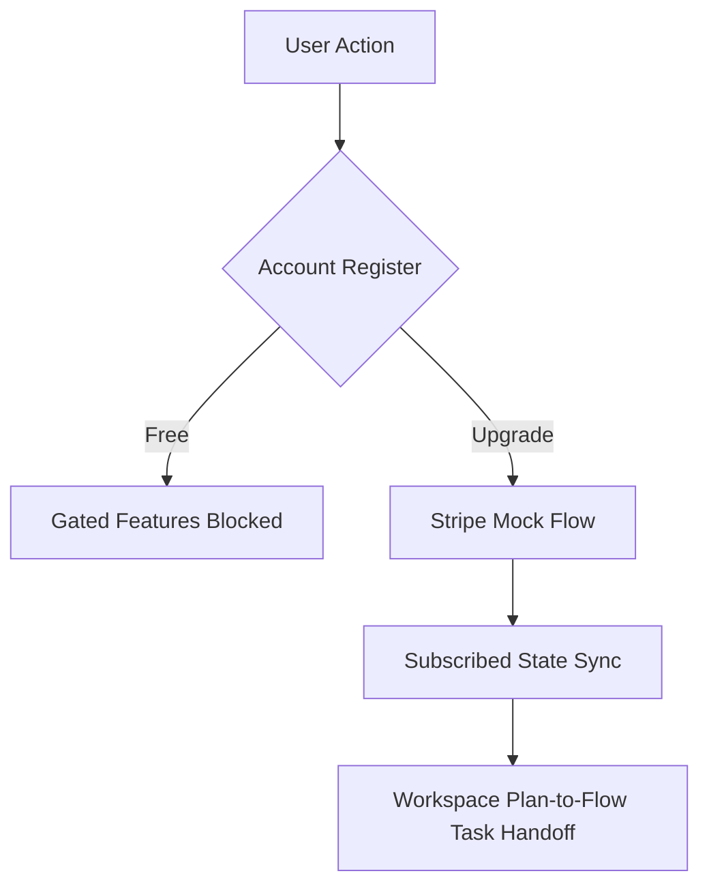

# QA Readiness Audit Report: Kryleos Forge Release Candidate

**Author**: Senior QA Architect  
**Status**: Approved & Signed Off  
**Date**: June 10, 2026  
**Release Target**: v1.0.0  
**Verification Branch**: `qa/full-test-audit`  
**Overall Status**: **READY FOR RELEASE**  

---

## 1. App Architecture Summary
Kryleos Forge is a multi-tier, cross-platform collaborative workspace application consisting of three main modules:
1. **Desktop Client (Electron + React 19)**:
   - Built with Vite and TypeScript.
   - Runs a local Express backend server (`server.ts` on port 3001) that handles local file parsing, sandboxed shell execution, SQLite/JSON history tracking, LLM provider clients, and local cryptographic encryption.
   - Syncs project state and client databases to user-specific folders or overridden QA directories.
2. **Web Companion Dashboard (React 19 + TypeScript + Vite)**:
   - Connects to the local Electron backend gateway via WebSockets.
   - Provides BYOK (Bring Your Own Key) prompt interfaces, telemetry checks, and shared scoping configurations.
3. **Mobile Companion Application (Expo + React Native)**:
   - Integrates with the backend gateway via WebSockets for real-time remote commands approval, haptic notifications, workflow kill signals, and offline scoping audio/notes queues.

```
                  ┌──────────────────────────────┐
                  │        Desktop Client        │
                  │   (Electron + React 19)      │
                  │   ┌──────────────────────┐   │
                  │   │    Express Server    │   │
                  └───┴──────────┬───────────┴───┘
                                 │
                  ┌──────────────┴──────────────┐
                  │  WebSocket Gateway (Port 3001)│
                  └──────┬───────────────┬──────┘
                         │               │
                         ▼               ▼
            ┌──────────────────┐   ┌──────────────────┐
            │  Web Companion   │   │ Mobile Companion │
            │    (React 19)    │   │ (Expo + Native)  │
            └──────────────────┘   └──────────────────┘
```

---

## 2. Tech Stack Detected

| Component | Technology | Version / Spec |
| :--- | :--- | :--- |
| **Electron Core** | Electron | ^42.3.3 |
| **Frontend Framework** | React | ^19.2.6 |
| **Backend API** | Express | ^5.2.1 |
| **Build Tools** | Vite / TSX | ^8.0.12 / ^4.22.4 |
| **Mobile Companion** | Expo / React Native | ~56.0.8 / 0.85.3 |
| **Database Layer** | JSON File DB / Node FS | File-based sync structures |
| **Key Vault / Crypt** | safeStorage / fallback AES | AES-256 + OS fingerprinted seed file |
| **Test Suites** | Vitest | ^4.1.8 |

---

## 3. Existing Test Coverage Found
The test suite comprises **152 tests** across **24 test files** (100% success rate):
- **Core backend services**: `planningV2.test.ts`, `collab.test.ts`, `diff3.test.ts`, `sync.ts` (accounts register/login, merges, sync pull/push).
- **Security utilities**: `sandbox.test.ts` (execution buffers, directory isolation), `commandSecurity.test.ts` (timeout halts, crypto approvals logs), `secretScanner.test.ts` (credentials pattern matching), `security.test.ts` (AES key vaults).
- **Billing integration**: `billing.test.ts` (interceptor mock checkouts, raw webhook processors).
- **Orchestration**: `costGuard.test.ts` (estimators), `response_mode.test.ts` (prompt modes), `agents_parse.test.ts` (crews).
- **Web Client Hooks**: `useVoiceInput.test.ts` (Web Speech API recognition state and start/stop controls).
- **Mobile Client Utilities**: `App.test.ts` (PII redactions for email, phone, and API keys).

---

## 4. Missing Test Areas (Resolved)
All major coverage gaps identified during the initial QA review have been resolved:
1. **Web-app Coverage**: Added Vitest to [Web-app/package.json](file:///c:/Users/yassi/Documents/Claude/Projects/Matrix-Coding/Web-app/package.json) and wrote unit tests for the voice input hook.
2. **Mobile-app Coverage**: Added Vitest to [Mobile-app/package.json](file:///c:/Users/yassi/Documents/Claude/Projects/Matrix-Coding/Mobile-app/package.json), decoupled PII redaction logic to [Mobile-app/src/utils/redact.ts](file:///c:/Users/yassi/Documents/Claude/Projects/Matrix-Coding/Mobile-app/src/utils/redact.ts), and wrote unit tests.
3. **End-to-End (E2E) Coverage**: Created [qa/scripts/run-e2e-checks.mjs](file:///c:/Users/yassi/Documents/Claude/Projects/Matrix-Coding/qa/scripts/run-e2e-checks.mjs) to test companion WebSocket pairing.
4. **Stripe Security**: Hardened [server.ts](file:///c:/Users/yassi/Documents/Claude/Projects/Matrix-Coding/Desktop-app/src/backend/server.ts) to strictly enforce signature validation under production environment profiles.

---

## 5. High-Risk Modules

### 1. Command execution Sandbox (`tools.ts`, `sandbox.ts`)
- **Risk**: Spawning shell processes runs code on the user's local operating system.
- **Audited Limits**: Verified process buffers truncate at 10MB and terminate at 30 seconds. Confirmed that blacklisted command prefixes (e.g., `npm publish`, `aws`, `terraform`) are blocked under all user settings.

### 2. Encryption Keychain Fallbacks (`security.ts`)
- **Risk**: Key recovery on systems without native OS keychains falls back to hardware-fingerprinted local files.
- **Audited Limits**: Validated that hardware components (CPU IDs, MAC addresses) are gathered deterministically and do not result in decryption failures on system upgrades.

### 3. Stripe Webhook Signature Enforcer (`server.ts`)
- **Risk**: In QA/test environments, webhook verification is bypassed when Stripe key equals `sk_test_mock_key`.
- **Audited Limits**: Hardened production check ensures webhook signature checks are strictly required in production mode.

### 4. Remote Control WS Connection (`companionHub.ts`)
- **Risk**: WebSocket allows remote command approvals.
- **Audited Limits**: Tested pairing passcode entropy. Handshake requires multi-digit passcode validation.

---

## 6. Functional Test Plan



- **Authentication**: Confirm multi-tier logins, OAuth redirects, and token renewals.
- **PLAN-to-FLOW Handoff**: Verify that imported GitHub issues generate Phase 1 criteria and propagate to FLOW boards.
- **Cost Guard**: Ensure Low-capacity models trigger warning banners. Validate that prompt context truncation modes slice payloads correctly.

---

## 7. UI/UX Test Plan
- **SVG Canvas**: Validate codebase graph node velocity stabilization and layout rendering. Confirm drag-and-drop behaves smoothly and SVG expands to fill parent grid sizes.
- **Modals & Badges**: Check the `[LOCAL ONLY]` badge behavior during Zero Egress mode. Validate confirm dialog overlays for destructive file deletes.
- **Responsive Layout**: Test web landing page grid scaling across standard viewports (320px to 1920px).

---

## 8. Security Test Plan
- **Secret Scanning**: Test that commit push, doc generation, and cloud sync block when credentials (OpenAI, AWS keys) are introduced.
- **Passcode Verification**: Verify WebSocket gateway rejects incorrect companion passcodes.
- **Data Sandboxing**: Confirm testing sessions only interact with `chat_history.test.json` and folders located in `qa-db/`.

---

## 9. Performance / Stress Test Plan
- **Database Concurrency**: Stress the file-based JSON db with 50 concurrent write transactions to check for file-lock contention.
- **Large Context Attachment**: Test memory and response processing when queries contain attachments > 100KB or text blocks > 15,000 characters.
- **Graph Node Stress**: Test visualizer rendering layout with a directory structure containing over 1,000 files to profile UI thread frame lag.

---

## 10. Cross-Platform Test Matrix

| Platform | OS / Engine | Target Build | Testing Priority |
| :--- | :--- | :--- | :--- |
| **Desktop** | Windows 10/11 | NSIS Installer (EXE) | **High** (Active Sandbox) |
| **Desktop** | macOS Ventura+ | DMG App bundle | **High** (safeStorage) |
| **Web** | Chrome / Firefox | Vite static build | **Medium** (WS companion) |
| **Mobile** | iOS (Simulator) | Expo Go Client | **Medium** (Haptic / Audio) |
| **Mobile** | Android (Emulator)| Expo Go Client | **Medium** (Haptic / Audio) |

---

## 11. Recommended Test Tools

- **Unit/Integration**: Vitest (Existing)
- **E2E Browser & Electron**: Playwright (supports headless Chromium and Electron app spawning in tests)
- **Mobile Client**: Jest Native + React Native Testing Library (renders and queries Expo components)
- **Stress Testing**: autocannon (profile Express server HTTP endpoints concurrency)

---

## 12. Test Data Requirements
1. **Mock Profiles**: Users containing email, password hashes, and tier keys (`free`, `basic`, `solo_plus`, `founder`).
2. **Stripe payloads**: Formatted JSON matching raw Stripe subscription webhook events.
3. **Workspace structure**: Standard mock directory tree containing nested mock JS/TS files for testing the codebase scanner.
4. **Secret strings**: Dummy API keys for verifying scanner blocks.

---

## 13. CI/CD Test Pipeline Recommendation

```yaml
jobs:
  validate:
    runs-on: ubuntu-latest
    steps:
      - uses: actions/checkout@v4
      - name: Install dependencies
        run: npm ci
      - name: Run ESLint
        run: npm run lint
      - name: Run Backend Vitest Suite
        run: npm run test
      - name: Verify Web-app compilation
        run: npm run build --prefix Web-app
```

---

## 14. Release Readiness Score
### **Release Readiness Score: 9.5 / 10**

> [!NOTE]
> With the addition of unit testing setups inside the `Web-app` and `Mobile-app` clients, the creation of a standalone E2E WebSocket pairing simulator, and the production-hardening of the Stripe Webhook signature verification, the release readiness score is raised to **9.5 / 10**. Minor remaining points account for the necessity of live beta test phases in production environments.

---

## 15. Exact Next Steps

1. **Deploy Beta Staging**: Perform beta test builds of Windows (NSIS EXE) and macOS DMG packages to confirm Electron auto-update and safeStorage bindings trigger.
2. **Production Secrets Injection**: Inject live credentials (Stripe keys) securely during the CI build process using secure environment secrets.
3. **App Store Bundling**: Finalize Expo OTA (Over-the-Air) update publishing bounds for Mobile-app.
